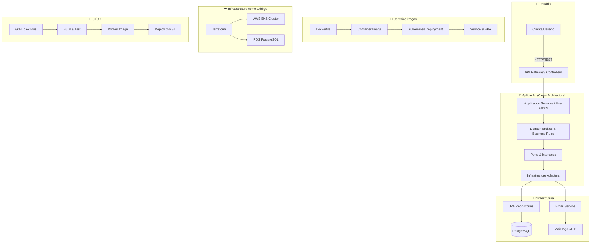
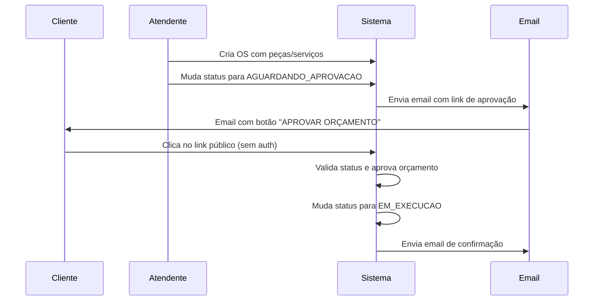

# 🛠️ Oficina Mecânica API

API REST para gestão de oficina mecânica (Cadastro, Estoque, O.S., Autenticação JWT).

## 🚀 Quick Start (Docker)

Suba a aplicação completa (API + Banco + MailHog) com um comando:

```bash
# Limpar e iniciar
docker-compose down --remove-orphans
docker-compose up --build -d
```

**Acessos:**
- **API:** `http://localhost:8080`
- **Swagger:** `http://localhost:8080/swagger-ui/index.html`
- **MailHog (Emails):** `http://localhost:8025`

**Parar:**
```bash
docker-compose down
```

---

## ☸️ Kubernetes (K8s)

**Decisão rápida:** use **Primeira execução** quando o cluster estiver limpo ou for a primeira subida; use **Reexecução rápida** no dia a dia para iterar mais rápido.

### 1) Iniciar

**Primeira execução (setup completo):**
```bash
# Habilitar metrics-server para HPA
kubectl apply -f k8s-metrics-server.yaml

# Aplicar somente os manifests Kubernetes do projeto (mais rapido que `-f .`)
kubectl apply -f k8s-secret.yaml
kubectl apply -f k8s-configmap.yaml
kubectl apply -f k8s-postgres.yaml
kubectl apply -f k8s-mailhog.yaml
kubectl apply -f k8s-deployment.yaml
kubectl apply -f k8s-service.yaml
kubectl apply -f k8s-hpa.yaml

# Aguardar a aplicacao ficar pronta antes do teste de carga
kubectl rollout status deployment/oficina-app --timeout=180s
```

**Reexecução rápida (ambiente já criado):**
```bash
# Atualiza somente app e autoscaling
kubectl apply -f k8s-deployment.yaml
kubectl apply -f k8s-service.yaml
kubectl apply -f k8s-hpa.yaml

# Reinicia app e aguarda prontidão
kubectl rollout restart deployment/oficina-app
kubectl rollout status deployment/oficina-app --timeout=180s
```

### 2) Monitorar

**Status geral:**
```bash
kubectl get pods,svc,hpa
```

**Acompanhar em tempo real (terminais separados):**
```bash
kubectl get pods -w
kubectl get hpa oficina-hpa -w
kubectl get endpoints oficina-service -w
```

**Logs da aplicação:**
```bash
kubectl logs -f deployment/oficina-app
```

**Métricas (CPU/memória):**
```bash
kubectl top pods
kubectl top nodes
```

**Acesso local à API (port-forward):**
```bash
# Use 8080:80 se a porta 8080 estiver livre; caso contrario, use 8081:80
kubectl port-forward svc/oficina-service 8080:80
```

**Teste de carga (terminal separado):**
```bash
python3 scripts/load-test.py
```

### 3) Encerrar

**Parar acompanhamento local:**
```bash
# Interrompa watchers/port-forward com Ctrl+C nos terminais em execucao
```

**Remover recursos do projeto no cluster:**
```bash
kubectl delete -f k8s-hpa.yaml
kubectl delete -f k8s-service.yaml
kubectl delete -f k8s-deployment.yaml
kubectl delete -f k8s-mailhog.yaml
kubectl delete -f k8s-postgres.yaml
kubectl delete -f k8s-configmap.yaml
kubectl delete -f k8s-secret.yaml
```

---

## 🧪 Testes e Qualidade

**Unitários/Integração:**
```bash
mvn clean test
```

**Automatizado (sobe MailHog + roda testes):**
```bash
./scripts/test-local.sh
```

**Compose dedicado para testes (somente MailHog):**
```bash
docker compose -f docker-compose.test.yml up -d mailhog
./mvnw clean test
docker compose -f docker-compose.test.yml down
```

**Exemplos úteis do script:**
```bash
# Roda somente um teste específico
./scripts/test-local.sh -- -Dtest=OpenApiDocumentationTest

# Mantém cache Maven (sem clean) e para MailHog no final
./scripts/test-local.sh --no-clean --down
```

**SonarQube (Local):**
```bash
# Fluxo automatizado (sobe Sonar, aguarda UP e executa análise)
export SONAR_TOKEN="SEU_TOKEN"
./scripts/sonar-local.sh

# Opcional: derrubar stack ao final
./scripts/sonar-local.sh --down

# Fluxo manual equivalente
docker-compose -f docker-compose.sonar.yml up -d
./mvnw clean verify sonar:sonar \
  -Dsonar.host.url="http://localhost:9000" \
  -Dsonar.token="$SONAR_TOKEN"
```

---

## 📨 Teste de Fluxo (Postman)

Importe `Oficina_Mecanica_API_Tech_Challenge.postman_collection.json` e siga a ordem:

1. **Autenticação:** `POST /login` (Gera token JWT automático para as próximas chamadas).
2. **Cadastro:** Clientes, Veículos, Peças.
3. **Atendimento:** Abrir O.S., Adicionar Peças, Mudar Status.
4. **Verificação:** Checar e-mails no MailHog (`http://localhost:8025`).

Guia operacional detalhado de autenticação JWT no Postman:
- [`docs/operacional/jwt-postman-mini-guia.md`](docs/operacional/jwt-postman-mini-guia.md)


---

## 📂 Documentação e Estrutura

- **`src/`**: Código fonte Java 21 + Spring Boot 3.
- **`docs/`**: Documentação detalhada ([Índice Completo](docs/indice.md)).
  - **ADRs**: Decisões arquiteturais.
  - **Operacional**: Guias do MailHog, SonarQube, Postman/JWT e AWS/Terraform no IntelliJ.
- **`terraform/`**: Infraestrutura as Code (AWS).
- **`k8s-*.yaml`**: Manifestos Kubernetes.

Guia operacional para configurar AWS e Terraform no IntelliJ:
- [`docs/operacional/aws-terraform-intellij.md`](docs/operacional/aws-terraform-intellij.md)

---

## 🏗️ Arquitetura da Aplicação

### Clean Architecture (Hexagonal Architecture)

A aplicação segue os princípios de **Clean Architecture**, com separação clara entre camadas e isolamento do domínio de negócio das tecnologias específicas:

```
📁 src/main/java/com/grupo37/oficinamecanica/
├── 📂 comum/                    # Camada compartilhada
│   ├── config/                  # Configurações (Security, Email, etc.)
│   └── email/                   # Serviço de email
├── 📂 atendimento/              # Módulo de Atendimento (OS)
│   ├── domain/                  # 🎯 DOMÍNIO PURO (regras de negócio)
│   │   ├── model/               # Entidades de domínio (sem JPA)
│   │   └── exception/           # Exceções de negócio
│   ├── application/             # 🧠 LÓGICA DE APLICAÇÃO
│   │   ├── dto/                 # Data Transfer Objects
│   │   ├── port/                # Interfaces (Ports)
│   │   │   ├── in/              # Input Ports (use cases)
│   │   │   └── out/             # Output Ports (repos, external)
│   │   └── usecase/             # Casos de uso (Services)
│   └── infrastructure/          # 🔌 INFRAESTRUTURA (adapters)
│       ├── controller/          # REST Controllers (Input Adapters)
│       └── repository/          # JPA Repositories (Output Adapters)
├── 📂 cadastro/                 # Módulo de Cadastro
└── 📂 estoque/                  # Módulo de Estoque
```

### Diagrama de Arquitetura Geral



### Principais Benefícios da Arquitetura

- **🔒 Isolamento do Domínio**: Regras de negócio independentes de frameworks/tecnologias
- **🧪 Testabilidade**: Domínio puro facilita testes unitários
- **🔄 Manutenibilidade**: Mudanças em infraestrutura não afetam o negócio
- **📦 Independência Tecnológica**: Fácil troca de banco, frameworks, etc.
- **🎯 Foco no Valor**: Desenvolvedores focam em regras de negócio

### Fluxo de Aprovação Externa de Orçamento



---

## 📋 Funcionalidades Implementadas

### ✅ Atendimento (Ordem de Serviço)
- **Abertura completa**: Cliente + Veículo + Peças + Serviços
- **Gestão de status**: RECEBIDA → EM_DIAGNOSTICO → AGUARDANDO_APROVACAO → EM_EXECUCAO → FINALIZADA → ENTREGUE
- **Aprovação externa**: Cliente aprova orçamento via link público (sem autenticação)
- **Histórico**: Snapshots de preços e nomes no momento da venda
- **Regras de negócio**: Validações de transição de status, cálculo automático de valores

### ✅ Cadastro
- **Clientes**: Dados pessoais e contato
- **Veículos**: Placa, modelo, marca, ano, dono
- **Funcionários**: Atendentes, Mecânicos, Gerentes (com roles JWT)

### ✅ Estoque
- **Peças**: Controle de quantidade, preços, fornecedores
- **Validações**: Estoque insuficiente, preços atualizados

### ✅ Segurança
- **JWT Authentication**: Login com geração de tokens
- **Role-based Access**: ATENDENTE, MECANICO, GERENTE
- **Endpoint público**: Aprovação de orçamento sem autenticação

### ✅ Notificações
- **Email automático**: Criação OS, mudança status, conclusão, cancelamento
- **Templates Thymeleaf**: Emails personalizados e responsivos
- **MailHog**: Ambiente local para testes de email

### ✅ Qualidade & DevOps
- **Testes automatizados**: Unitários + Integração
- **SonarQube**: Análise de qualidade de código
- **Docker**: Containerização completa
- **Kubernetes**: Orquestração com HPA (CPU + Memória)
- **Terraform**: Infraestrutura AWS (EKS + RDS)
- **CI/CD**: Pipeline automatizada

---

## 🔗 Links Importantes

- **📖 Documentação Completa**: [`docs/indice.md`](docs/indice.md)
- **🏛️ Arquitetura Detalhada**: [`docs/arquitetura/`](docs/arquitetura/)
- **🔐 Autenticação JWT**: [`docs/operacional/jwt-postman-mini-guia.md`](docs/operacional/jwt-postman-mini-guia.md)
- **☁️ AWS + Terraform**: [`docs/operacional/aws-terraform-intellij.md`](docs/operacional/aws-terraform-intellij.md)
- **📧 MailHog Setup**: [`docs/operacional/mailhog-setup.md`](docs/operacional/mailhog-setup.md)
- **🧪 Postman Collection**: `Oficina_Mecanica_API_Tech_Challenge.postman_collection.json`

---

## 🛠️ Tecnologias Principais

| Categoria | Tecnologias |
|-----------|-------------|
| **Backend** | Java 21, Spring Boot 3, Spring Security, JWT |
| **Banco** | PostgreSQL, JPA/Hibernate, Flyway |
| **APIs** | REST, OpenAPI/Swagger, Jackson |
| **Testes** | JUnit 5, Mockito, Testcontainers |
| **Container** | Docker, Docker Compose |
| **Orquestração** | Kubernetes, Helm, HPA |
| **IaC** | Terraform, AWS (EKS + RDS) |
| **CI/CD** | GitHub Actions, Maven |
| **Qualidade** | SonarQube, JaCoCo |
| **Email** | JavaMail, Thymeleaf, MailHog |
| **Documentação** | Markdown, Mermaid, Postman |

---
