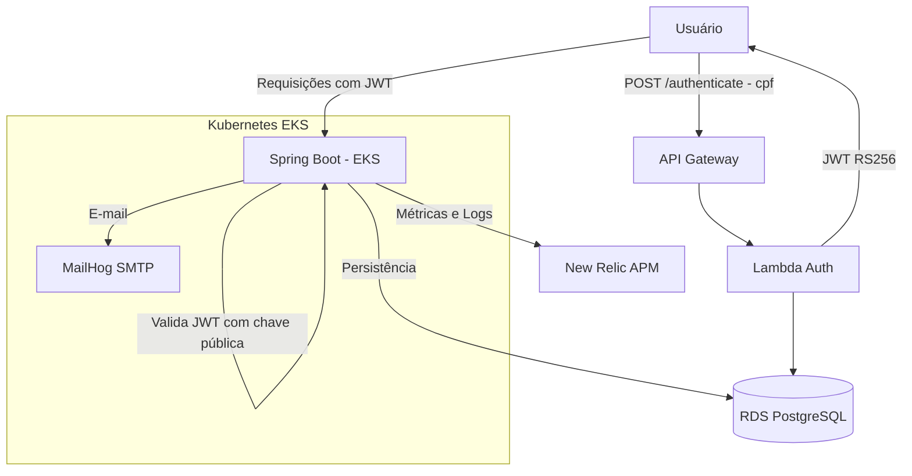

# fiap-tech-challenge-app

> **Fase 4 (Tech Challenge):** este repositório está em refatoração — passa a hospedar o **OS Service**, um dos microsserviços da nova arquitetura distribuída. Veja a visão geral completa em [`docs/arquitetura/fase4-visao-geral.md`](docs/arquitetura/fase4-visao-geral.md) e as decisões em [`docs/ADRs/`](docs/ADRs/).

## Propósito

Aplicação principal Spring Boot para o sistema de gerenciamento de oficina mecânica. Autentica usuários via CPF usando AWS Lambda (RS256 JWT), persiste dados no RDS PostgreSQL e roda em cluster Kubernetes (EKS) com observabilidade via New Relic.

**Faz parte do Tech Challenge Fase 3 — FIAP SOAT.**

## Arquitetura



## Tech Stack

- **Java 21** + **Spring Boot 3.x**
- **Spring Security** — validação JWT RS256 com chave pública RSA
- **Spring Data JPA / Hibernate** — ORM com PostgreSQL
- **Flyway** — migrações de banco de dados
- **New Relic APM** — observabilidade e métricas
- **Docker** + **Amazon ECR** — containerização e registro de imagens
- **Kubernetes (EKS)** — orquestração com HPA, probes e LoadBalancer
- **MailHog** — servidor SMTP in-cluster para testes de e-mail

## Estrutura do Projeto

```
.
├── src/                      ← Código-fonte Spring Boot
├── k8s/
│   ├── deployment.yaml       ← Deployment com startupProbe/liveness/readiness
│   ├── service.yaml          ← Service tipo LoadBalancer (AWS ELB)
│   ├── configmap.yaml        ← Variáveis de configuração (Lambda URL, New Relic…)
│   ├── serviceaccount.yaml   ← ServiceAccount do pod
│   ├── ingress.yaml          ← Ingress (opcional)
│   └── hpa.yaml              ← HorizontalPodAutoscaler
├── k8s-mailhog.yaml          ← Deployment + Service do MailHog in-cluster
├── Dockerfile
└── .github/workflows/
    └── deploy.yml            ← Pipeline CI/CD (build → ECR → EKS)
```

## Pré-requisitos

- [Java 21](https://adoptium.net/)
- [Maven](https://maven.apache.org/) (ou use o `./mvnw` incluído)
- [Docker](https://www.docker.com/) para build da imagem
- Cluster EKS provisionado ([k8s-terraform](https://github.com/ThaisAzuos/fiap-tech-challenge-k8s-terraform))
- Banco RDS PostgreSQL provisionado ([db-terraform](https://github.com/ThaisAzuos/fiap-tech-challenge-db-terraform))
- Lambda Auth implantada ([lambda-auth](https://github.com/ThaisAzuos/fiap-tech-challenge-lambda-auth))

## Fluxo de Autenticação

```
1. Cliente POST /authenticate  {"cpf": "12345678901"}  → API Gateway → Lambda
2. Lambda valida CPF no RDS e retorna JWT (RS256, assinado com private_key.pem)
3. Cliente envia o JWT no header: Authorization: Bearer <token>
4. Spring Boot valida o JWT com a public_key.pem montada em /app/public_key.pem
```

## Quick Start (Local)

```bash
# 1. Subir dependências locais
docker-compose up -d postgres mailhog

# 2. Configurar variáveis
export SPRING_DATASOURCE_URL=jdbc:postgresql://localhost:5432/oficina
export SPRING_DATASOURCE_USERNAME=oficina_admin
export SPRING_DATASOURCE_PASSWORD=SuaSenha
export LAMBDA_AUTH_URL=https://gs9sfvolq0.execute-api.us-east-1.amazonaws.com/prod

# 3. Build e execução
./mvnw clean package -DskipTests
java -jar target/oficinamecanica-0.0.1-SNAPSHOT.jar
```

Swagger disponível em: `http://localhost:8080/swagger-ui/index.html`

## Ambiente Local Completo (Fase 4 — microsservicos)

Para subir também a mensageria e os bancos NoSQL usados pelos demais microsserviços (Billing Service e Execution Service):

```bash
docker-compose -f docker-compose.yml -f docker-compose.fase4.yml up -d
```

Isso adiciona RabbitMQ (management UI em `http://localhost:15672`) e um MongoDB para cada um dos dois serviços. Ver `docker-compose.fase4.yml` e o diagrama geral em [`docs/arquitetura/fase4-visao-geral.md`](docs/arquitetura/fase4-visao-geral.md).

## Deploy CI/CD (GitHub Actions)

O workflow `.github/workflows/deploy.yml` é acionado por push na `main` ou `workflow_dispatch`.

**Etapas:**
1. Build com Maven (`./mvnw clean package -DskipTests`)
2. Login no ECR + build e push da imagem Docker com tag `${{ github.sha }}`
3. Criação/atualização dos Kubernetes Secrets (`app-secrets`, `newrelic-secret`, `jwt-public-key`)
4. Apply dos manifestos K8s (ConfigMap, Service, Ingress, HPA, Deployment)
5. `kubectl rollout status` aguardando estabilização (timeout 300s)
6. Diagnóstico de pods e logs (executado sempre, mesmo em falha)

**Secrets necessários no repositório:**

| Secret | Descrição |
|--------|-----------|
| `AWS_ACCESS_KEY_ID` | Credencial AWS |
| `AWS_SECRET_ACCESS_KEY` | Credencial AWS |
| `AWS_SESSION_TOKEN` | Token de sessão (AWS Academy) |
| `DB_HOST` | Endpoint do RDS (output `db_address` do db-terraform) |
| `DB_NAME` | Nome do banco de dados |
| `DB_USER` | Usuário do banco de dados |
| `DB_PASSWORD` | Senha do banco de dados |
| `JWT_PUBLIC_KEY` | Chave pública RSA (conteúdo do `public_key.pem`) |
| `NEW_RELIC_LICENSE_KEY` | Chave de licença do New Relic |

> Para atualizar as credenciais AWS em todos os repositórios de uma vez, use o script `C:\pos-fiap\fase3\update-aws-secrets.ps1`.

## URLs da Aplicação (produção)

| Recurso | URL |
|---------|-----|
| App (LoadBalancer) | `http://a6a6b06e9240f4910af0d43d399a3e39-2051355113.us-east-1.elb.amazonaws.com` |
| Swagger UI | `.../swagger-ui/index.html` |
| Lambda Auth | `https://gs9sfvolq0.execute-api.us-east-1.amazonaws.com/prod` |
| MailHog (port-forward) | `kubectl port-forward svc/oficina-mailhog 8025:8025` → `http://localhost:8025` |

## Observabilidade

- **Health checks**: `/actuator/health/liveness` e `/actuator/health/readiness`
- **Métricas Prometheus**: `/actuator/prometheus`
- **New Relic**: APM auto-instrumentado via agente Java (`newrelic-secret` no cluster)

## Repositórios Relacionados

| Repo | Descrição |
|------|-----------|
| [fiap-tech-challenge-k8s-terraform](https://github.com/ThaisAzuos/fiap-tech-challenge-k8s-terraform) | Cluster EKS — provisione primeiro |
| [fiap-tech-challenge-db-terraform](https://github.com/ThaisAzuos/fiap-tech-challenge-db-terraform) | Banco RDS PostgreSQL |
| [fiap-tech-challenge-lambda-auth](https://github.com/ThaisAzuos/fiap-tech-challenge-lambda-auth) | Autenticação serverless Lambda |
