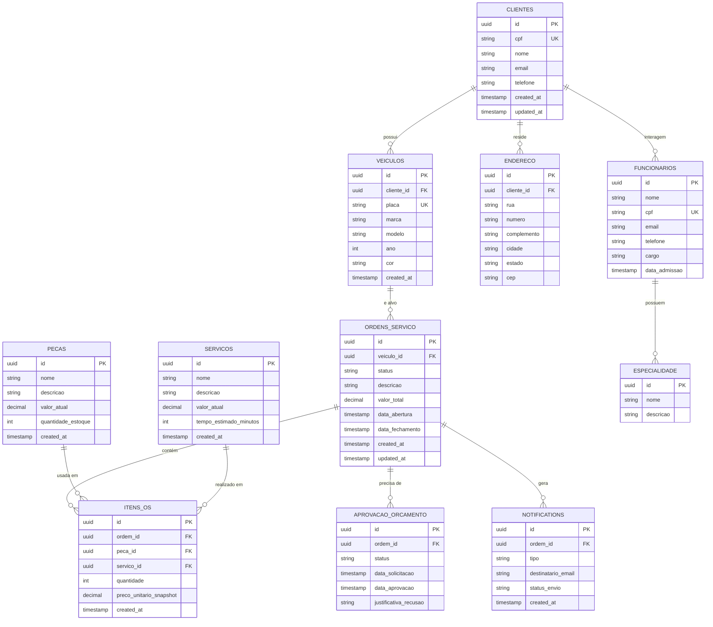
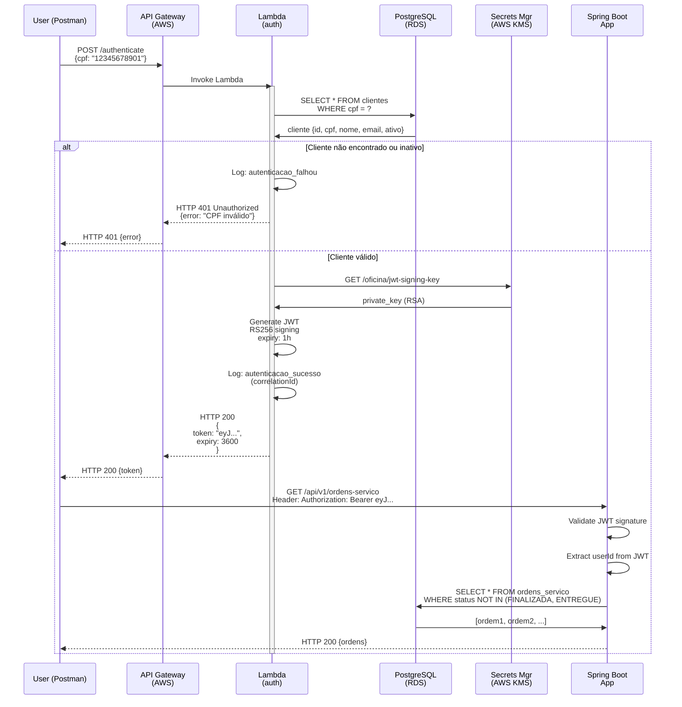
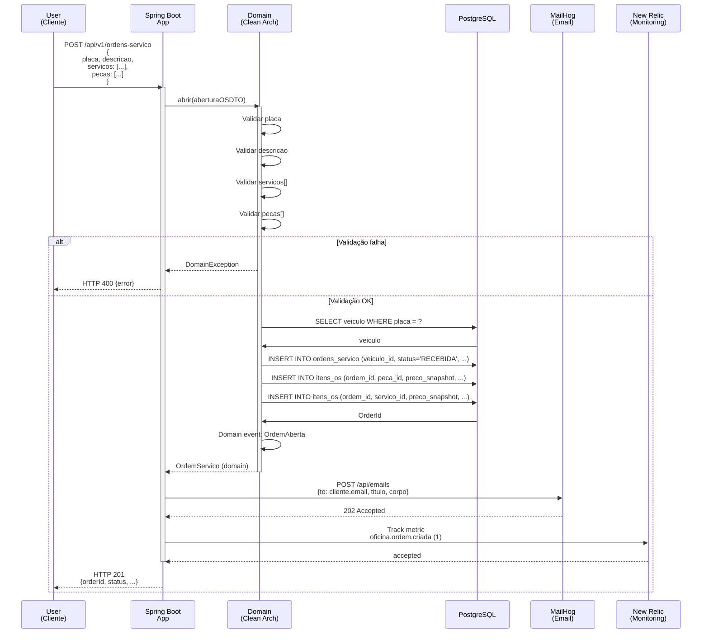
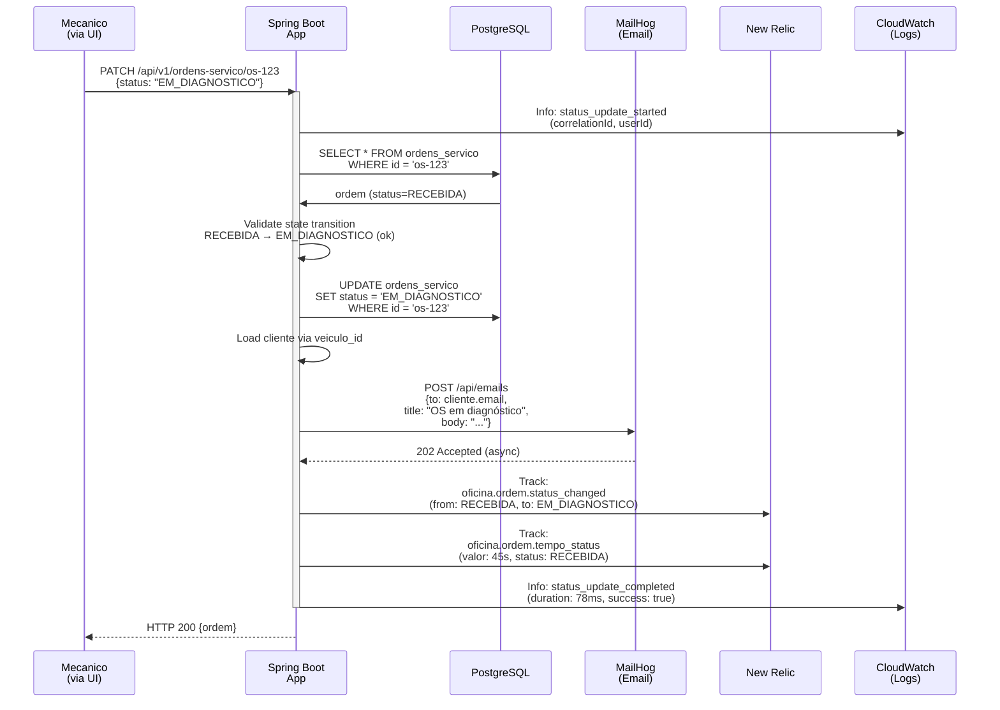
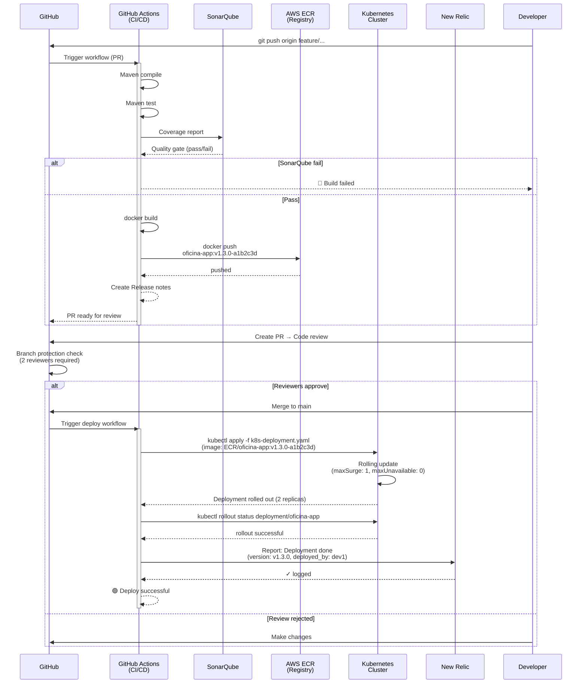
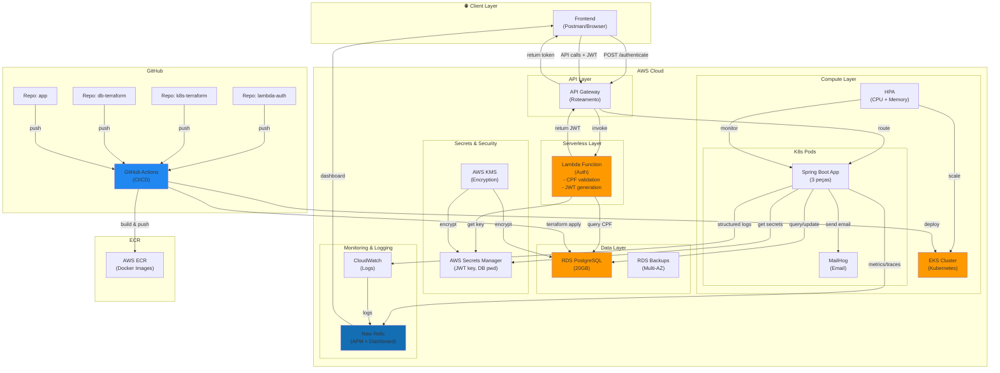

# Diagramas ER e Sequência - Fase 3

## 📊 Diagrama Entidade-Relacionamento (ER)

### Visão Relacional Completa



### Descrição dos Relacionamentos

| Relacionamento | Tipo | Descrição |
|---|---|---|
| **CLIENTES → VEICULOS** | 1:N | Um cliente pode possuir vários veículos |
| **CLIENTES → ENDERECO** | 1:1 | Um cliente tem um endereço principal |
| **VEICULOS → ORDENS_SERVICO** | 1:N | Um veículo gera múltiplas ordens de serviço |
| **ORDENS_SERVICO → ITENS_OS** | 1:N | Uma OS tem múltiplos itens (peças + serviços) |
| **PECAS → ITENS_OS** | N:N | Uma peça pode ser usada em múltiplas OS |
| **SERVICOS → ITENS_OS** | N:N | Um serviço pode ser realizado em múltiplas OS |
| **ORDENS_SERVICO → APROVACAO_ORCAMENTO** | 1:1 | Uma OS tem um orçamento + aprovação |
| **ORDENS_SERVICO → NOTIFICACTIONS** | 1:N | Uma OS gera multiple notificações |

### Constraints & Índices

```sql
-- Unique constraints
ALTER TABLE clientes ADD CONSTRAINT uk_clientes_cpf UNIQUE(cpf);
ALTER TABLE veiculos ADD CONSTRAINT uk_veiculos_placa UNIQUE(placa);
ALTER TABLE funcionarios ADD CONSTRAINT uk_funcionarios_cpf UNIQUE(cpf);

-- Indexes para performance
CREATE INDEX idx_ordens_veiculo ON ordens_servico(veiculo_id);
CREATE INDEX idx_ordens_status ON ordens_servico(status);
CREATE INDEX idx_ordens_data_abertura ON ordens_servico(data_abertura DESC);
CREATE INDEX idx_itens_ordem ON itens_os(ordem_id);
CREATE INDEX idx_notificacoes_ordem ON notificacoes(ordem_id);
CREATE INDEX idx_veiculos_cliente ON veiculos(cliente_id);

-- JSON index se usar campo JSONB
CREATE INDEX idx_ordens_metadados ON ordens_servico USING GIN (metadados);
```

---

## 🔄 Diagramas de Sequência

### 1. Fluxo de Autenticação (Lambda + API Gateway)



**Timing esperado**:
- Cold start Lambda: ~3000ms (primeira chamada)
- Warm Lambda: ~200-300ms
- DB query: ~50ms
- JWT generation: ~10ms
- **Total P95**: ~300ms (depois aquecido)

---

### 2. Fluxo de Abertura de Ordem de Serviço



**Timing esperado**:
- Validação domínio: ~10ms
- DB query veiculo: ~30ms
- DB insert OS + itens: ~40ms
- Email send: ~100ms (async)
- Total: ~250ms P95

---

### 3. Fluxo de Alteração de Status + Notificação



**SLA de notificação**: Email dentro de 5 minutos

---

### 4. Deployment to Kubernetes (CI/CD Pipeline)



**SLA de Deploy**:
- Build: < 5 minutos
- Test: < 3 minutos
- Image push: < 1 minuto
- K8s rollout: < 2 minutos
- **Total**: < 15 minutos

---

## 📐 Diagrama de Componentes (Fase 3)



---

## Checklist - Diagrama de Componentes

- ✅ Fluxo de autenticação (User → AW → Lambda → App)
- ✅ Isolamento de camadas (API → Serverless → Compute → Data)
- ✅ Segurança integrada (KMS, Secrets Manager)
- ✅ Observabilidade (New Relic, CloudWatch)
- ✅ CI/CD pipeline (GitHub → Actions → ECR → K8s)
- ✅ Alta disponibilidade (Multi-AZ RDS, HPA K8s)


