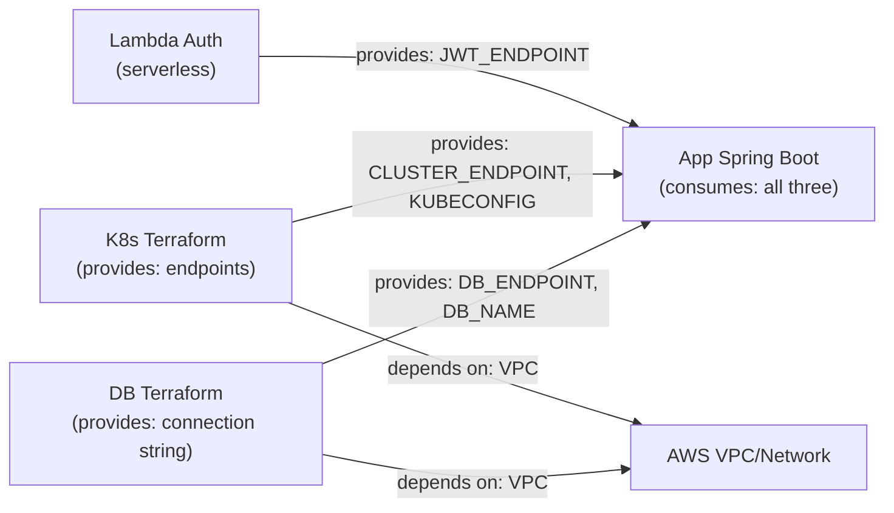

# Estrutura dos 4 Repositórios - Fase 3

**Autoria**: Tech Lead + DevOps  
**Data**: 2026-04-27  
**Status**: 📋 Template Preparado  

---

## 📚 Visão Geral dos Repositórios

| Repositório | Responsabilidade | Tech Stack | Leads |
|---|---|---|---|
| **1. lambda-auth** | Autenticação serverless (CPF → JWT) | Node.js/Python, AWS Lambda, Terraform | DevOps |
| **2. k8s-terraform** | Infraestrutura Kubernetes | Terraform, AWS EKS, Kubernetes | DevOps |
| **3. db-terraform** | Infraestrutura banco dados | Terraform, AWS RDS, PostgreSQL | DBA + DevOps |
| **4. app** | Aplicação principal | Java 17, Spring Boot, Maven | Backend Lead |

---

## 📦 Repositório 1: fiap-tech-challenge-lambda-auth

**Propósito**: Função serverless para autenticação via CPF  
**URL**: `https://github.com/FIAP-org/fiap-tech-challenge-lambda-auth`  
**Owner**: DevOps Lead  
**Linguagem**: Python 3.11 (recomendado) ou Node.js 18  

### Estrutura de Diretórios

```
fiap-tech-challenge-lambda-auth/
├── README.md                          ← Setup, deploy, troubleshooting
├── Dockerfile                         ← Imagem para ECR (opcional)
├── requirements.txt                   ← Dependências Python
├── .github/
│   └── workflows/
│       ├── build.yml                  ← Build + test + push ECR
│       └── deploy.yml                 ← Deploy Lambda (manual approval)
├── src/
│   ├── handler.py                     ← Entrada Lambda (entrypoint)
│   ├── auth_service.py                ← Lógica autenticação
│   ├── cpf_validator.py               ← Validação CPF
│   ├── jwt_generator.py               ← Geração JWT
│   ├── db_client.py                   ← Conexão RDS
│   └── logger.py                      ← Structured logging JSON
├── tests/
│   ├── test_handler.py
│   ├── test_cpf_validator.py
│   └── test_jwt_generator.py
├── terraform/
│   ├── main.tf                        ← Lambda definition
│   ├── variables.tf
│   ├── outputs.tf
│   ├── lambda_role.tf                 ← IAM role + policies
│   └── api_gateway.tf                 ← API Gateway config
└── scripts/
    ├── build.sh                       ← Build Docker image
    ├── test-local.sh                  ← Test com SAM (sam-cli)
    └── deploy.sh                      ← Deploy via Terraform

```

### CI/CD Workflow (GitHub Actions)

```yaml
# .github/workflows/build.yml
name: Build & Test Lambda

on:
  push:
    branches: [develop, main]
  pull_request:
    branches: [develop, main]

jobs:
  build:
    runs-on: ubuntu-latest
    steps:
      - uses: actions/checkout@v3
      - uses: actions/setup-python@v4
        with:
          python-version: '3.11'
      
      - name: Install dependencies
        run: pip install -r requirements.txt
      
      - name: Run tests
        run: pytest tests/ -v --cov
      
      - name: Build Docker image
        run: docker build -t oficina-lambda-auth:${{ github.sha }} .
      
      - name: Push to ECR
        if: github.ref == 'refs/heads/main'
        run: |
          aws ecr get-login-password | docker login --username AWS --password-stdin $ECR_REGISTRY
          docker tag oficina-lambda-auth:${{ github.sha }} $ECR_REGISTRY/oficina-lambda-auth:v1.0.0-${{ github.sha }}
          docker push $ECR_REGISTRY/oficina-lambda-auth:v1.0.0-${{ github.sha }}
```

### Branch Protection
```
main branch
├── Dismissal stale PR reviews
├── 2 required approvals
├── Require build status check
└── No force push (admins included)
```

### README Mínimo
```markdown
# Lambda Authentication Function

## Purpose
Validar CPF do cliente e gerar JWT para acesso às APIs.

## Stack
- Python 3.11
- AWS Lambda
- AWS API Gateway
- PostgreSQL (RDS)

## Local Setup
```bash
pip install -r requirements.txt
python -m pytest tests/
```

## Deploy
```bash
terraform init
terraform plan
terraform apply  # Requer MFA
```

## Exemplo cURL
```bash
curl -X POST https://api.oficina-mecanica.com/authenticate \
  -H "Content-Type: application/json" \
  -d '{"cpf": "12345678901"}'
# Response:
# {
#   "token": "eyJ...",
#   "expiry": 3600
# }
```

## Links
- [Documentação Geral](../docs/Fase03/PlanoFase3Completo.md)
- [App Principal](../fiap-tech-challenge-app)
```

---

## 📦 Repositório 2: fiap-tech-challenge-k8s-terraform

**Propósito**: Infraestrutura Kubernetes em AWS (EKS)  
**URL**: `https://github.com/FIAP-org/fiap-tech-challenge-k8s-terraform`  
**Owner**: DevOps Lead  
**Tech**: Terraform, Kubernetes, AWS EKS  

### Estrutura Terraform

```
fiap-tech-challenge-k8s-terraform/
├── README.md                          ← Setup, deploy, cost warnings
├── .github/
│   └── workflows/
│       ├── validate.yml               ← terraform fmt, terraform validate
│       ├── plan.yml                   ← terraform plan (show changes)
│       └── apply.yml                  ← terraform apply (manual approval)
├── modules/
│   ├── vpc/
│   │   ├── main.tf                    ← Subnets, route tables, IGW
│   │   ├── variables.tf
│   │   └── outputs.tf
│   ├── eks/
│   │   ├── main.tf                    ← EKS cluster definition
│   │   ├── node_group.tf              ← Worker nodes (t3.medium)
│   │   ├── variables.tf
│   │   └── outputs.tf
│   ├── hpa/
│   │   ├── main.tf                    ← HPA config (CPU + Memory)
│   │   ├── variables.tf
│   │   └── outputs.tf
│   └── rbac/
│       ├── main.tf                    ← Service accounts, roles
│       └── variables.tf
├── envs/
│   ├── dev.tfvars                     ← Variables dev
│   ├── staging.tfvars                 ← Variables staging
│   └── prod.tfvars                    ← Variables prod (fewer replicas)
├── main.tf                            ← Root module
├── variables.tf
├── outputs.tf
├── terraform.tfstate                  ← State file (versioned, backed up)
├── terraform.tfstate.backup
└── scripts/
    ├── init.sh                        ← terraform init
    ├── plan.sh                        ← terraform plan + save plan
    ├── apply.sh                       ← terraform apply
    └── destroy.sh                     ← ⚠️ Emergency only

```

### Configuração Exemplo (modules/eks/main.tf)

```hcl
resource "aws_eks_cluster" "oficina" {
  name            = "oficina-eks-${var.environment}"
  version         = "1.28"
  role_arn        = aws_iam_role.eks_cluster_role.arn

  vpc_config {
    subnet_ids              = var.subnet_ids
    endpoint_private_access = true
    endpoint_public_access  = true
  }

  depends_on = [
    aws_iam_role_policy_attachment.eks_cluster_policy,
  ]

  tags = {
    Environment = var.environment
  }
}

resource "aws_eks_node_group" "workers" {
  cluster_name    = aws_eks_cluster.oficina.name
  node_group_name = "oficina-workers-${var.environment}"
  node_role_arn   = aws_iam_role.eks_node_role.arn
  subnet_ids      = var.subnet_ids

  scaling_config {
    desired_size = 2
    max_size     = 10
    min_size     = 2
  }

  instance_types = ["t3.medium"]

  tags = {
    Environment = var.environment
  }
}
```

### Outputs (outputs.tf)

```hcl
output "cluster_endpoint" {
  value = aws_eks_cluster.oficina.endpoint
}

output "cluster_arn" {
  value = aws_eks_cluster.oficina.arn
}

output "kubeconfig" {
  value = {
    cluster_name       = aws_eks_cluster.oficina.name
    endpoint           = aws_eks_cluster.oficina.endpoint
    certificate_authority_data = aws_eks_cluster.oficina.certificate_authority[0].data
  }
}

output "node_group_id" {
  value = aws_eks_node_group.workers.id
}
```

### CI/CD Workflow

```yaml
# .github/workflows/apply.yml
name: Terraform Apply

on:
  push:
    branches: [main]

jobs:
  apply:
    runs-on: ubuntu-latest
    environment: production  # Requer manual approval
    steps:
      - uses: actions/checkout@v3
      - uses: hashicorp/setup-terraform@v2
        with:
          terraform_version: 1.5.0
      
      - name: Configure AWS credentials
        uses: aws-actions/configure-aws-credentials@v2
        with:
          role-to-assume: ${{ secrets.AWS_ROLE_TO_ASSUME }}
          aws-region: us-east-1
      
      - name: Terraform Init
        run: terraform init
      
      - name: Terraform Plan
        run: terraform plan -var-file=envs/prod.tfvars -out=tfplan
      
      - name: Terraform Apply
        run: terraform apply tfplan
      
      - name: Export outputs
        run: |
          terraform output -json > outputs.json
          # Guardar como GitHub env var para app repo
          echo "K8S_ENDPOINT=$(terraform output -raw cluster_endpoint)" >> $GITHUB_ENV
```

### Outputs Públicos (para App Repo)

```bash
# Exportar como GitHub environment variables
CLUSTER_ENDPOINT="https://ABC123.eks.us-east-1.amazonaws.com"
CLUSTER_NAME="oficina-eks-prod"
NODE_GROUP_ID="oficina-workers-prod"
KUBECONFIG_BASE64="<base64-encoded-kubeconfig>"
```

### README Mínimo
```markdown
# Kubernetes Infrastructure (Terraform)

## Purpose
Provisionar cluster EKS, VPC, node groups, HPA.

## Variables
- `aws_region`: us-east-1
- `cluster_name`: oficina-eks
- `node_instance_type`: t3.medium
- `desired_nodes`: 2

## Deploy
```bash
terraform init
terraform plan -var-file=envs/prod.tfvars
terraform apply -var-file=envs/prod.tfvars
```

## Cost Estimation
- EKS: $0.10/hour (~$73/mês)
- Nodes (2x t3.medium): ~$60/mês
- **Total**: ~$133/mês

## Links
- [DB Infrastructure](../fiap-tech-challenge-db-terraform)
- [App Deployment](../fiap-tech-challenge-app)
```

---

## 📦 Repositório 3: fiap-tech-challenge-db-terraform

**Propósito**: Infraestrutura RDS PostgreSQL  
**URL**: `https://github.com/FIAP-org/fiap-tech-challenge-db-terraform`  
**Owner**: DBA + DevOps  
**Tech**: Terraform, AWS RDS, PostgreSQL 15  

### Estrutura

```
fiap-tech-challenge-db-terraform/
├── README.md                          ← RDS setup, backup, restore
├── .github/workflows/apply.yml
├── modules/
│   └── rds/
│       ├── main.tf                    ← RDS instance
│       ├── backup.tf                  ← Backup policy
│       ├── security_group.tf          ← RDS security group
│       ├── variables.tf
│       └── outputs.tf
├── migrations/
│   ├── V1__initial_schema.sql         ← Flyway migrations
│   ├── V2__add_notification_table.sql
│   └── ... (versionadas)
├── envs/
│   ├── dev.tfvars
│   ├── staging.tfvars
│   └── prod.tfvars
├── main.tf
├── variables.tf
├── outputs.tf
└── scripts/
    ├── backup.sh                      ← Backup manual
    ├── restore.sh                     ← Restore from snapshot
    └── test-connection.sh             ← Teste conexão

```

### Configuração RDS (main.tf)

```hcl
resource "aws_db_instance" "oficina" {
  identifier            = "oficina-db-${var.environment}"
  engine               = "postgres"
  engine_version       = "15.2"
  instance_class       = "db.t4g.micro"
  allocated_storage    = 20

  db_name  = "oficina"
  username = "postgres"
  password = random_password.db_password.result

  # Multi-AZ for HA
  multi_az = true

  # Backup policy
  backup_retention_period          = 29
  backup_window                    = "03:00-04:00"
  preferred_maintenance_window     = "sun:04:00-sun:05:00"

  # Encryption
  storage_encrypted = true
  kms_key_id        = aws_kms_key.rds.arn

  # Performance & monitoring
  performance_insights_enabled = true
  monitoring_interval          = 60
  monitoring_role_arn          = aws_iam_role.rds_monitoring.arn

  # Security
  vpc_security_group_ids = [aws_security_group.rds.id]
  publicly_accessible    = false

  skip_final_snapshot = false
  final_snapshot_identifier = "oficina-db-final-${formatdate("YYYY-MM-DD-hhmm", timestamp())}"

  tags = {
    Environment = var.environment
  }
}
```

### Outputs (outputs.tf)

```hcl
output "db_endpoint" {
  value = aws_db_instance.oficina.endpoint
  sensitive = true
}

output "db_port" {
  value = aws_db_instance.oficina.port
}

output "db_name" {
  value = aws_db_instance.oficina.db_name
}

output "master_username" {
  value = aws_db_instance.oficina.username
}
```

### Flyway Migrations

```sql
-- V1__initial_schema.sql
CREATE TABLE clientes (
  id UUID PRIMARY KEY DEFAULT gen_random_uuid(),
  cpf VARCHAR(11) UNIQUE NOT NULL,
  nome VARCHAR(255) NOT NULL,
  email VARCHAR(255) UNIQUE NOT NULL,
  telefone VARCHAR(20),
  ativo BOOLEAN DEFAULT true,
  created_at TIMESTAMP DEFAULT CURRENT_TIMESTAMP,
  updated_at TIMESTAMP DEFAULT CURRENT_TIMESTAMP
);

CREATE INDEX idx_clientes_cpf ON clientes(cpf);
CREATE INDEX idx_clientes_email ON clientes(email);

-- ... mais tables
```

### README Mínimo
```markdown
# Database Infrastructure (RDS PostgreSQL)

## Backup Policy
- Daily backups, 29-day retention
- Multi-AZ for automatic failover
- RTO: ~1 hour, RPO: ~1 day

## Restore from Snapshot
```bash
./scripts/restore.sh --snapshot-id rds:oficina-db-2026-04-26
```

## Connection String
```
postgresql://postgres:PASSWORD@DB_ENDPOINT:5432/oficina
```

## Migrations (Flyway)
```bash
# Migrations run automatically on app startup
# or manually:
docker run --rm flyway/flyway -url=jdbc:postgresql://... migrate
```

## Cost
- db.t4g.micro: ~$30/mês
- Storage (20GB SSD-gp3): ~$2/mês
- Backups: ~$2/mês
```

---

## 📦 Repositório 4: fiap-tech-challenge-app

**Propósito**: Aplicação principal Spring Boot  
**URL**: `https://github.com/FIAP-org/fiap-tech-challenge-app`  
**Owner**: Backend Lead  
**Tech**: Java 17, Spring Boot 3.1, Maven  

### Estrutura (Migrada da atual)

```
fiap-tech-challenge-app/
├── README.md                          ← Setup, deploy, API docs link
├── pom.xml                            ← Maven sem terraform/ section
├── Dockerfile                         ← Multi-stage build
├── .github/workflows/
│   ├── build-test.yml                 ← Maven compile, test, SonarQube
│   ├── docker-build.yml               ← Docker build, ECR push
│   └── deploy.yml                     ← kubectl apply (manual approval)
├── src/main/java/com/grupo37/oficinamecanica/
│   ├── cadastro/
│   │   ├── domain/
│   │   │   └── model/                 ← Pure domain models (no JPA)
│   │   ├── application/
│   │   │   └── ports/                 ← Input/output ports
│   │   └── infrastructure/
│   │       └── adapters/              ← JPA entities, REST controllers
│   ├── atendimento/
│   │   ├── domain/
│   │   ├── application/
│   │   └── infrastructure/
│   └── shared/                         ← Config, utils, exceptions
├── src/main/resources/
│   ├── application.yml
│   ├── application-dev.yml
│   └── db/migration/                  ← Flyway scripts (se houver)
├── k8s/
│   ├── deployment.yaml                ← K8s deployment
│   ├── service.yaml
│   ├── hpa.yaml
│   ├── configmap.yaml
│   └── secret.yaml
├── docker-compose.yml                 ← Local: app + mailhog (BD via env)
└── README-DEPLOYMENT.md               ← Deploy specifics

```

### Mudanças no pom.xml

```xml
<!-- Remove Terraform dependencies -->
<!-- Remove desnecessários (removido) -->

<!-- Add AWS SDK para Lambda calls -->
<dependency>
  <groupId>software.amazon.awssdk</groupId>
  <artifactId>lambda</artifactId>
  <version>2.20.0</version>
</dependency>

<!-- Add New Relic APM  -->
<dependency>
  <groupId>com.newrelic.agent.java</groupId>
  <artifactId>newrelic-java</artifactId>
  <version>8.1.0</version>
</dependency>

<!-- Add Micrometer para métricas -->
<dependency>
  <groupId>io.micrometer</groupId>
  <artifactId>micrometer-registry-new-relic</artifactId>
  <version>1.11.0</version>
</dependency>

<!-- Existing: actuator, spring-boot-starter-data-jpa, etc -->
```

### CI/CD Workflow (build-test.yml)

```yaml
name: Build & Test

on:
  push:
    branches: [develop, main]
  pull_request:
    branches: [develop, main]

jobs:
  build-test:
    runs-on: ubuntu-latest
    steps:
      - uses: actions/checkout@v3
      - uses: actions/setup-java@v3
        with:
          java-version: '17'
          distribution: 'temurin'
          cache: maven
      
      - name: Build with Maven
        run: mvn clean compile
      
      - name: Run tests
        run: mvn test
      
      - name: SonarQube Scan
        if: github.ref == 'refs/heads/main' || github.event_name == 'pull_request'
        run: |-
          mvn sonar:sonar \
            -Dsonar.projectKey=oficina-api \
            -Dsonar.host.url=${{ secrets.SONARQUBE_HOST }} \
            -Dsonar.login=${{ secrets.SONARQUBE_TOKEN  }}
      
      - name: Upload coverage to Codecov
        uses: codecov/codecov-action@v3
```

### Kubernetes Deployment (deployment.yaml)

```yaml
apiVersion: apps/v1
kind: Deployment
metadata:
  name: oficina-app
spec:
  replicas: 2
  selector:
    matchLabels:
      app: oficina-app
  template:
    metadata:
      labels:
        app: oficina-app
    spec:
      containers:
      - name: oficina-app
        image: XXXXXX.dkr.ecr.us-east-1.amazonaws.com/oficina-app:v1.3.0-a1b2c3d
        ports:
        - containerPort: 8080
        env:
        - name: DB_HOST
          valueFrom:
            configMapKeyRef:
              name: app-config
              key: db-host
        - name: DB_PASSWORD
          valueFrom:
            secretKeyRef:
              name: app-secrets
              key: db-password
        - name: JWT_SECRET
          valueFrom:
            secretKeyRef:
              name: app-secrets
              key: jwt-secret
        - name: LAMBDA_AUTH_ENDPOINT
          valueFrom:
            configMapKeyRef:
              name: app-config
              key: lambda-endpoint
        livenessProbe:
          httpGet:
            path: /actuator/health
            port: 8080
          initialDelaySeconds: 30
          periodSeconds: 10
        readinessProbe:
          httpGet:
            path: /actuator/health/readiness
            port: 8080
          initialDelaySeconds: 10
          periodSeconds: 5
```

### README Mínimo
```markdown
# Oficina Mecânica - Aplicação Principal

## Architecture
- **Clean Architecture**: Domain → Application → Infrastructure
- **API Gateway**: AWS API Gateway roteando para esta app
- **Auth**: JWT via Lambda (não gerado internamente)

## Tech Stack
- Java 17
- Spring Boot 3.1
- PostgreSQL 15 (RDS)
- New Relic APM
- Kubernetes (EKS)

## Local Setup
```bash
docker-compose up
# App roda em http://localhost:8080
# Swagger: http://localhost:8080/swagger-ui.html
```

## Deploy to Kubernetes
```bash
# Outputs do repo k8s-terraform são necessários
export K8S_ENDPOINT=$(cat ../k8s-terraform/outputs.json | jq -r '.cluster_endpoint.value')

kubectl set image deployment/oficina-app \
  oficina-app=XXXXXX.dkr.ecr.us-east-1.amazonaws.com/oficina-app:v1.3.0-a1b2c3d
```

## Links
- [Lambda Auth](../fiap-tech-challenge-lambda-auth)
- [K8s Infrastructure](../fiap-tech-challenge-k8s-terraform)
- [DB Infrastructure](../fiap-tech-challenge-db-terraform)
- [Swagger/OpenAPI](http://localhost:8080/swagger-ui.html)
```

---

## 🔗 Integração Inter-Repos

### Diagrama de Dependências



### Secrets Cross-Repo

```bash
# Cada repo tem seus GitHub Secrets

# lambda-auth repo
AWS_ACCESS_KEY_ID
AWS_SECRET_ACCESS_KEY

# k8s-terraform repo
AWS_ACCESS_KEY_ID
AWS_SECRET_ACCESS_KEY

# db-terraform repo
AWS_ACCESS_KEY_ID
AWS_SECRET_ACCESS_KEY

# app repo
AWS_ACCESS_KEY_ID
AWS_SECRET_ACCESS_KEY
LAMBDA_AUTH_ENDPOINT           # valor do lambda-auth outputs
K8S_CLUSTER_ENDPOINT           # valor do k8s-terraform outputs
DB_HOST                         # valor do db-terraform outputs
```

### GitHub Organization Structure

```
FIAP Organization
├── fiap-tech-challenge-lambda-auth
│   └── Teams: @devops-team, @soat-architecture (admin)
├── fiap-tech-challenge-k8s-terraform
│   └── Teams: @devops-team, @soat-architecture (admin)
├── fiap-tech-challenge-db-terraform
│   └── Teams: @dba-team, @soat-architecture (admin)
└── fiap-tech-challenge-app
    └── Teams: @backend-team, @soat-architecture (admin)
```

---

## 📊 Checklist de Setup Fase 3b

- [ ] 4 repositórios criados no GitHub
- [ ] soat-architecture adicionado como admin em todos
- [ ] Branch protection configurada (2 reviewers, checks automatizados)
- [ ] GitHub Secrets criados em cada repo
- [ ] GitHub Actions workflows criados e testados
- [ ] DIRs .env.example documentados
- [ ] README.md completos em cada repo
- [ ] Terraform validado (terraform validate)
- [ ] Dockerfiles funcionando (docker build -t...)
- [ ] Cross-repo dependencies documentadas
- [ ] Links verificados em todos os READMEs

---

**Próximo Passo**: Implementar Fase 3b início conforme este template.


