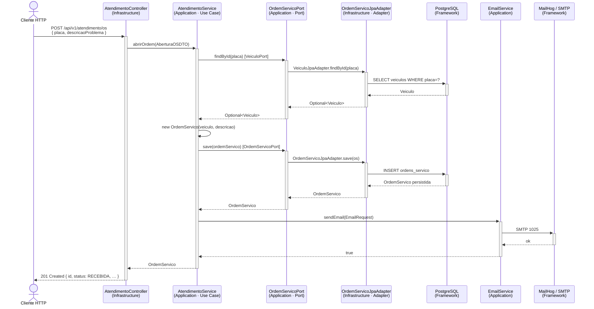
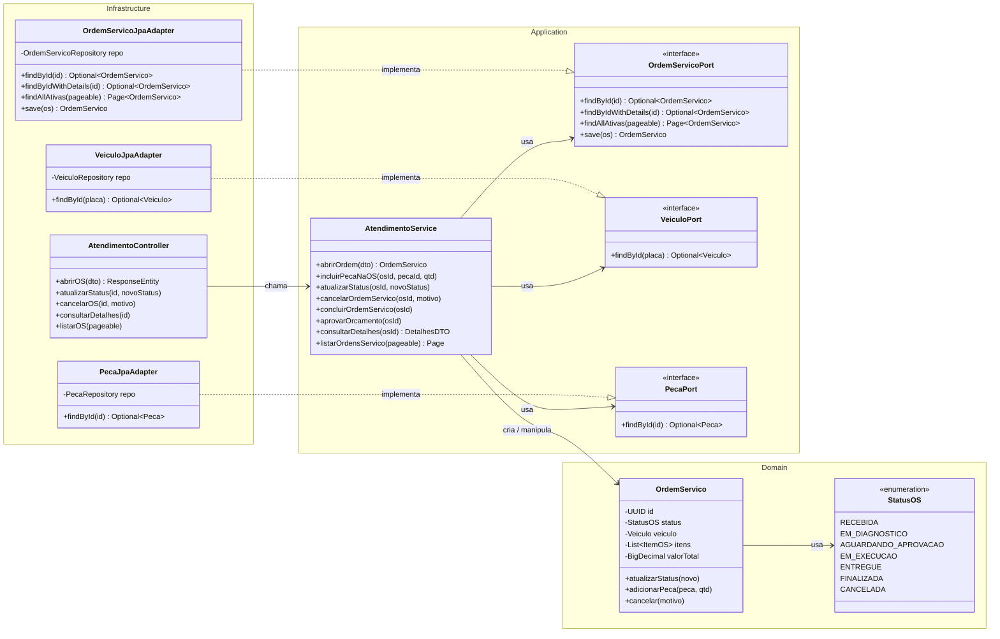
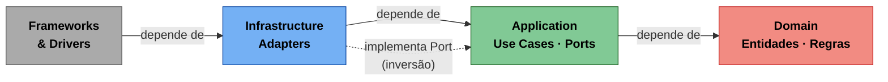

# Diagrama — Clean Architecture na Oficina Mecânica API

> Gerado em 23/03/2026 · Reflete o estado atual do código-fonte.

---

## 1. Visão geral das camadas

Mostra as quatro camadas concêntricas e os pacotes reais do projeto em cada uma delas.

```mermaid
graph TD
    subgraph FRAMEWORKS["⬛ Frameworks & Drivers (mais externo)"]
        direction TB
        HTTP["HTTP Client\n(Postman / Browser)"]
        DB["PostgreSQL / H2"]
        MAIL["MailHog / SMTP"]
        JWT_LIB["java-jwt"]
        SPRING["Spring Boot 3.4"]
    end

    subgraph INFRA["🟦 Infrastructure (Adaptadores)"]
        direction TB
        CTRL_AT["AtendimentoController"]
        CTRL_CAD["ClienteController\nVeiculoController\nFuncionarioController"]
        CTRL_EST["PecaController"]
        CTRL_AGD["AgendamentoController"]
        CTRL_SEC["LoginController"]
        REPO_AT["OrdemServicoJpaAdapter\nPecaJpaAdapter\nVeiculoJpaAdapter"]
        REPO_CAD["ClienteRepository\nVeiculoRepository\nFuncionarioRepository"]
        REPO_EST["PecaRepository"]
        REPO_AGD["AgendamentoRepository"]
        REPO_SEC["UsuarioRepository"]
        SEC_FILTER["JwtTokenFilter\nSecurityConfig"]
    end

    subgraph APP["🟩 Application (Use Cases & Ports)"]
        direction TB
        UC_AT["AtendimentoService\n(use case)"]
        UC_CAD["CadastroService\nVeiculoService\nFuncionarioService"]
        UC_EST["PecaService"]
        UC_AGD["AgendamentoService"]
        UC_SEC["JwtTokenService\nDetalheUsuarioService"]
        UC_EMAIL["EmailService\nEmailServiceImpl"]
        PORT_OS["≪port≫ OrdemServicoPort"]
        PORT_PECA["≪port≫ PecaPort"]
        PORT_VEI["≪port≫ VeiculoPort"]
        DTO["DTOs de entrada/saída\n(AberturaOSDTO, OrdemServicoListDTO…)"]
    end

    subgraph DOMAIN["🟥 Domain (núcleo)"]
        direction TB
        ENT_OS["OrdemServico\nItemOS\nStatusOS"]
        ENT_CAD["Cliente · Veiculo · Funcionario\nCpf · Email · Placa · Endereco"]
        ENT_EST["Peca"]
        ENT_AGD["Agendamento\nJanelaServico · TipoAgendamento"]
        ENT_SEC["Usuario · Perfil"]
        EXC["BusinessException"]
    end

    %% Dependências: sempre de fora para dentro
    FRAMEWORKS -->|usa| INFRA
    INFRA -->|usa| APP
    APP -->|usa| DOMAIN

    %% Inversão de dependência via ports
    REPO_AT -.->|implementa| PORT_OS
    REPO_AT -.->|implementa| PORT_PECA
    REPO_AT -.->|implementa| PORT_VEI

    %% Estilo
    classDef domain fill:#f28b82,stroke:#c62828,color:#000
    classDef app fill:#81c995,stroke:#1b5e20,color:#000
    classDef infra fill:#74b0f4,stroke:#0d47a1,color:#000
    classDef fw fill:#555,stroke:#333,color:#fff

    class ENT_OS,ENT_CAD,ENT_EST,ENT_AGD,ENT_SEC,EXC domain
    class UC_AT,UC_CAD,UC_EST,UC_AGD,UC_SEC,UC_EMAIL,PORT_OS,PORT_PECA,PORT_VEI,DTO app
    class CTRL_AT,CTRL_CAD,CTRL_EST,CTRL_AGD,CTRL_SEC,REPO_AT,REPO_CAD,REPO_EST,REPO_AGD,REPO_SEC,SEC_FILTER infra
    class HTTP,DB,MAIL,JWT_LIB,SPRING fw
```

---

## 2. Fluxo de uma requisição — módulo `atendimento` (Clean Architecture completo)

O módulo **atendimento** é o único que implementa a Clean Architecture completa com Ports & Adapters. Os demais módulos seguem arquitetura em camadas simples.

---

## 3. Inversão de Dependência (Ports & Adapters) — atendimento

Mostra a **Dependency Rule**: o Use Case conhece apenas a interface (Port); o Adapter concreto fica na camada de infraestrutura.

---

## 4. Grau de adoção por módulo

| Módulo | Domain | Use Case | Port (interface) | Adapter | Controller | Classificação |
|---|:---:|:---:|:---:|:---:|:---:|---|
| **atendimento** | ✅ | ✅ `AtendimentoService` | ✅ `OrdemServicoPort` etc. | ✅ `JpaAdapter` | ✅ | **Clean Architecture completa** |
| **cadastro** | ✅ | ✅ `CadastroService` | ❌ direto no repo | ❌ | ✅ | Camadas simples |
| **estoque** | ✅ | ✅ `PecaService` | ❌ direto no repo | ❌ | ✅ | Camadas simples |
| **agendamento** | ✅ | ✅ `AgendamentoService` | ❌ direto no repo | ❌ | ✅ | Camadas simples |
| **seguranca** | ✅ | ✅ `JwtTokenService` | ❌ direto no repo | ❌ | ✅ `LoginController` | Camadas simples |
| **comum** | ❌ | ✅ `EmailService` | — | — | — | Utilitário transversal |

> **Nota:** A Clean Architecture completa foi aplicada intencionalmente apenas no módulo `atendimento` (núcleo de negócio). Os demais módulos seguem arquitetura em camadas clássica por simplicidade e praticidade, conforme documentado no [ADR-002](../ADRs/ADR-002-clean-architecture.md).

---

## 5. Regra de Dependência — resumo visual

A seta pontilhada representa a **Inversão de Dependência**: o Adapter (Infrastructure) implementa uma interface (Port) definida na camada Application, garantindo que o núcleo nunca dependa de detalhes externos.

