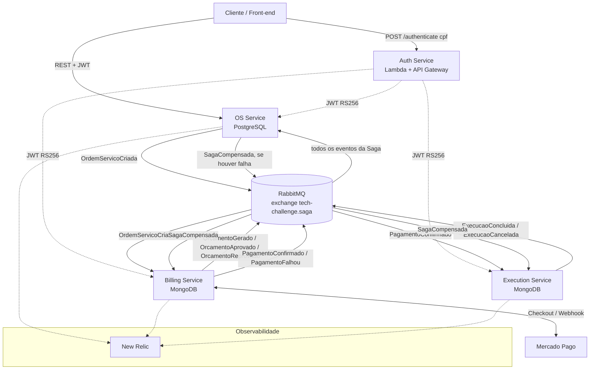
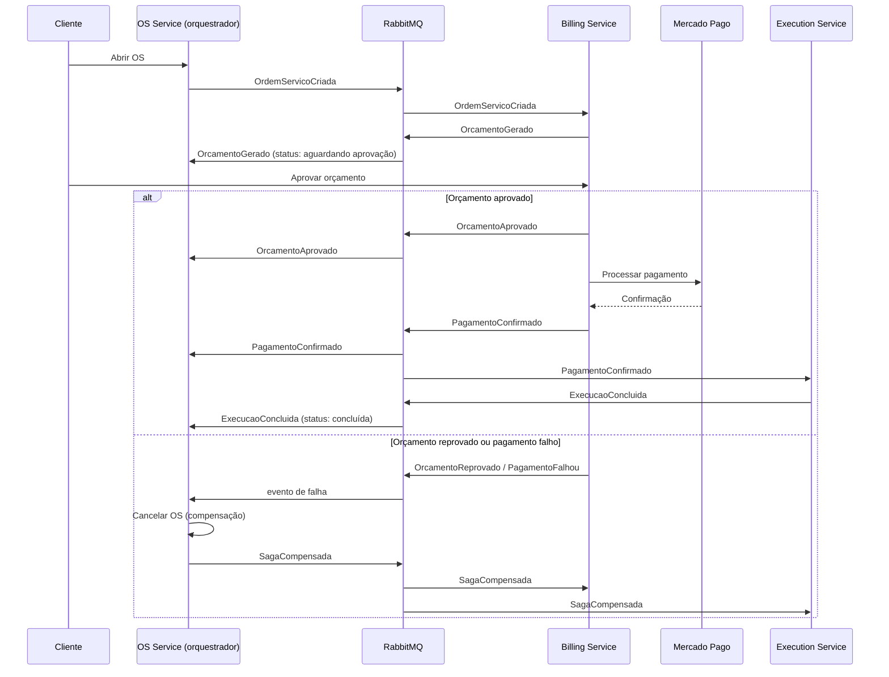

# Fase 4 — Visão Geral da Arquitetura de Microsserviços

> Documento de referência único para a arquitetura da Fase 4. Os demais repositórios (`fiap-tech-challenge-lambda-auth`, `fiap-tech-challenge-k8s-terraform`, `fiap-tech-challenge-db-terraform`, `fiap-tech-challenge-billing-service`, `fiap-tech-challenge-execution-service`) referenciam este documento em seus próprios READMEs em vez de duplicá-lo.

## Serviços

| Serviço | Repositório | Banco próprio | Responsabilidade |
|---|---|---|---|
| OS Service | `fiap-tech-challenge-app` | PostgreSQL (RDS) | Cadastro, abertura de OS, status/histórico, orquestração da Saga |
| Billing Service | `fiap-tech-challenge-billing-service` | MongoDB | Orçamento, aprovação, integração Mercado Pago, confirmação de pagamento |
| Execution Service | `fiap-tech-challenge-execution-service` | MongoDB | Fila de execução, diagnóstico, reparo, conclusão |
| Auth Service | `fiap-tech-challenge-lambda-auth` | — (sem estado) | Emissão de JWT (RS256), validado localmente pelos 3 serviços de negócio |
| Infra de cluster | `fiap-tech-challenge-k8s-terraform` | — | EKS, VPC, namespaces por serviço, RabbitMQ e MongoDB via Helm |
| Infra de dados | `fiap-tech-challenge-db-terraform` | — | RDS PostgreSQL dedicado ao OS Service |

Decisões detalhadas: ver `docs/ADRs/ADR-005` a `ADR-008` neste repositório.

## Diagrama de componentes

## Diagrama de sequência da Saga (orquestrada, fluxo feliz + compensação)

## Convenções de mensageria

- Exchange único, tipo *topic*: `tech-challenge.saga`.
- Routing keys no padrão `<contexto>.<evento>` (ex.: `os.criada`, `orcamento.aprovado`).
- Uma fila por serviço consumidor, com dead-letter queue configurada.
- Contratos de evento (JSON Schema) em [`docs/arquitetura/eventos/`](./eventos/README.md).

## Status deste documento

Rascunho inicial produzido no Dia 1 do plano de execução da Fase 4. Será refinado (principalmente o diagrama de componentes, com nomes finais de filas/namespaces) ao longo da semana e fechado em sua versão final no Dia 7, para uso no PDF de entrega.
